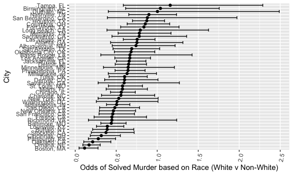

jv2629\_hw6
================
Jaclyn Verity - jv2629
November 27, 2018

Introduction
============

This document is to practice using linear models and graphing them for the Data Science Course HW 6.

Problem 1
=========

**Load the data.**

``` r
require(RCurl)
hom_raw = read_csv("https://raw.githubusercontent.com/washingtonpost/data-homicides/master/homicide-data.csv") 
```

    ## Parsed with column specification:
    ## cols(
    ##   uid = col_character(),
    ##   reported_date = col_integer(),
    ##   victim_last = col_character(),
    ##   victim_first = col_character(),
    ##   victim_race = col_character(),
    ##   victim_age = col_character(),
    ##   victim_sex = col_character(),
    ##   city = col_character(),
    ##   state = col_character(),
    ##   lat = col_double(),
    ##   lon = col_double(),
    ##   disposition = col_character()
    ## )

**Clean the data.**

``` r
hom_clean = hom_raw %>% 
  mutate(city_state = paste(city, state, sep = ', '),
         outcome = as.factor(ifelse(disposition == 'Closed by arrest', 1, 0))) %>% 
  filter(!(city_state %in% c("Dallas, TX", "Phoenix, AZ", "Kansas City, MO", "Tulsa, AL"))) %>% 
   mutate(victim_race = as.factor(ifelse(victim_race == "White", "white", "non-white" )),
         victim_age = as.numeric(victim_age),
         victim_sex = as.factor(victim_sex),
         victim_race = fct_relevel(victim_race, "white", "non-white"))
```

    ## Warning in eval(substitute(expr), envir, enclos): NAs introduced by
    ## coercion

**Run a GLM Model for Baltimore.**

``` r
hom_balt = hom_raw %>% 
  mutate(city_state = paste(city, state, sep = ', '),
         outcome = as.factor(ifelse(disposition == 'Closed by arrest', 'solved', 'unsolved'))) %>% 
  filter(!(city_state %in% c("Dallas, TX", "Phoenix, AZ", "Kansas City, MO", "Tulsa, AL"))) %>% 
  filter(city_state == "Baltimore, MD") %>% 
  mutate(victim_race = as.factor(ifelse(victim_race == "White", "white", "non-white" )),
         victim_age = as.numeric(victim_age),
         victim_sex = as.factor(victim_sex),
         victim_race = fct_relevel(victim_race, "white", "non-white"))

balt_outcomes = hom_balt %>% 
   glm(outcome ~ victim_age + victim_race + victim_sex, data = ., family = binomial()) %>% 
  broom::tidy() %>% 
  mutate(OR = exp(estimate),
         low_OR = exp(estimate*1.96 - std.error),
         high_OR = exp(estimate*1.96 + std.error)) %>%
  select(OR, low_OR, high_OR, p.value) %>% 
  knitr::kable(digits = 3)
```

Creating a function for running glm and pulling it into a table.

``` r
hom_glm = hom_clean %>% 
  select(city_state, victim_race, victim_age, victim_sex, outcome)

glm_resolv_func = function(df){
  
 glm(df$outcome ~ df$victim_age + df$victim_race + df$victim_sex, data = df, family = binomial()) %>% 
    broom::tidy() %>% 
  mutate(OR = exp(estimate),
         low_OR = exp(estimate - (1.96 * std.error)),
         high_OR = exp(estimate + (1.96 * std.error))) %>%
  select(term, OR, low_OR, high_OR)
}
```

Run function and create data frame.

``` r
hom_nest = nest(hom_glm, victim_race:outcome)

or_outcomes = hom_nest %>% 
  mutate(glm_out =
    map(hom_nest$data, glm_resolv_func)) %>% 
  select(-data) %>% 
  unnest() %>% 
  janitor::clean_names()
```

Plot of victim race for each city.

``` r
race_plot = or_outcomes %>% 
  filter(term == "df$victim_racenon-white")

race_plot %>% 
  mutate(city_state = fct_reorder(city_state, or)) %>% 
ggplot(aes(x = city_state, y = or)) +
  coord_flip() +
  geom_point() + 
  geom_errorbar(aes(ymin = low_or, ymax = high_or)) +
  theme(axis.text.x = element_text(angle = 80, hjust = 1)) +
  labs(x = "City", y = "Odds of Solved Murder based on Race (White v Non-White)")
```



Problem 2
=========

**Load and clean data set for analysis on birthweight.**

``` r
raw_birth = read_csv("./data/birthweight.csv") %>% 
  janitor::clean_names()
```

    ## Parsed with column specification:
    ## cols(
    ##   .default = col_integer(),
    ##   gaweeks = col_double(),
    ##   ppbmi = col_double(),
    ##   smoken = col_double()
    ## )

    ## See spec(...) for full column specifications.

A number of studies have researched what influences a baby's birthweight. From my experience with the literature I am selecting: - ppbmi = mother's pre pregnancy bmi (pounds) - gaweeks = gestational age (weeks) - smoken = average number of cigarettes smoked per day during pregnancy

A mother's pre pregnancy bmi has been shown to incease a babys birthweight by 37 grams for every 1 unit increase in bmi. Baby's meet milestones for development and weight at certain ages of gestation, it's age at birth will be related to birth weight. Smoking has also been shown to affect babies development which will affect the birth weight.

**Clean data for linear regressions.**

``` r
clean_birth = raw_birth %>% 
  select(blength, bwt, bhead, babysex, ppbmi, gaweeks, smoken) %>% 
  mutate(babysex = as.factor(babysex))

na.omit(clean_birth)
```

    ## # A tibble: 4,342 x 7
    ##    blength   bwt bhead babysex ppbmi gaweeks smoken
    ##      <int> <int> <int> <fct>   <dbl>   <dbl>  <dbl>
    ##  1      51  3629    34 2        26.3    39.9      0
    ##  2      48  3062    34 1        21.3    25.9      0
    ##  3      50  3345    36 2        23.6    39.9      1
    ##  4      52  3062    34 1        21.8    40       10
    ##  5      52  3374    34 2        21.0    41.6      1
    ##  6      52  3374    33 1        18.6    40.7      0
    ##  7      46  2523    33 2        14.3    40.3      0
    ##  8      49  2778    33 2        21.8    37.4      0
    ##  9      52  3515    36 1        19.9    40.3      0
    ## 10      50  3459    33 1        24.9    40.7      4
    ## # ... with 4,332 more rows

**Modeling.**

``` r
fit = lm(bwt ~ ppbmi + gaweeks + smoken, data = clean_birth)

fit %>% broom::glance()
```

    ## # A tibble: 1 x 11
    ##   r.squared adj.r.squared sigma statistic   p.value    df  logLik    AIC
    ## *     <dbl>         <dbl> <dbl>     <dbl>     <dbl> <int>   <dbl>  <dbl>
    ## 1     0.185         0.184  463.      328. 4.09e-192     4 -32804. 65619.
    ## # ... with 3 more variables: BIC <dbl>, deviance <dbl>, df.residual <int>

``` r
fit %>% 
  broom::tidy() %>% 
  select(term, estimate, p.value) %>% 
  knitr::kable(digits = 3)
```

| term        |  estimate|  p.value|
|:------------|---------:|--------:|
| (Intercept) |   206.413|    0.037|
| ppbmi       |    13.405|    0.000|
| gaweeks     |    67.086|    0.000|
| smoken      |    -6.304|    0.000|
